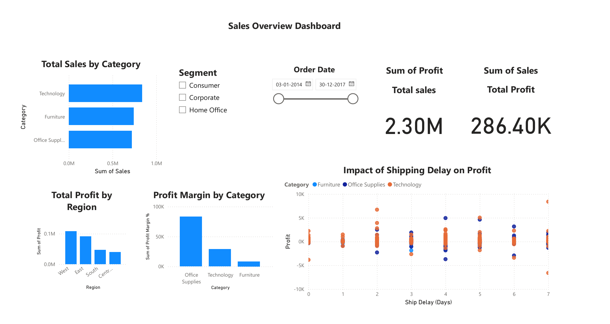
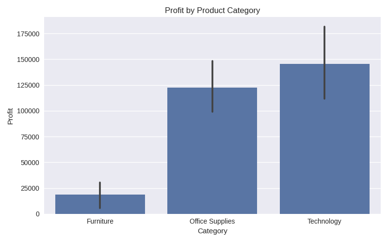
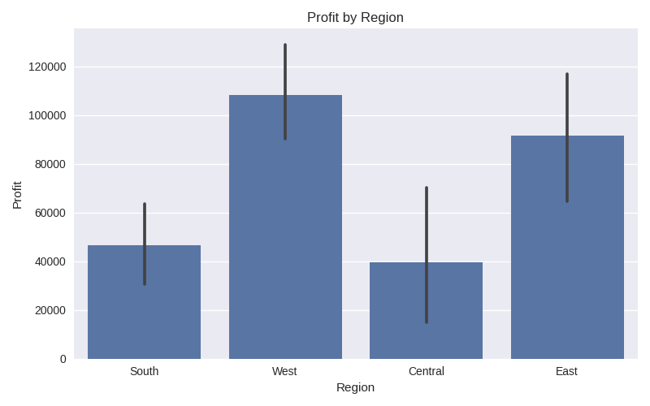
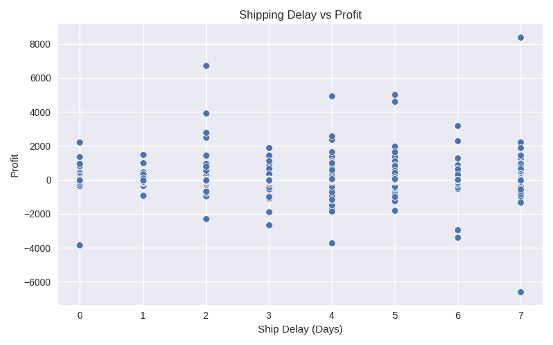

## 📊 E-Commerce Sales Analytics | Python + SQL + Power BI
This project analyzes retail sales performance to uncover revenue drivers, customer value insights, and operational inefficiencies.
Using real Superstore sales data, the goal is to support business decision-making with data-driven insights.

## 🔍 Project Objectives
1. Identify top-performing product categories and regions
2. Analyze how discounting impacts profitability
3. Evaluate shipping performance and delays
4. Discover high-value customers for retention strategies

## 🧠 Skill Highlights
| **Category**          | **Key Skills / Tools**                      |
| --------------------- | ------------------------------------------- |
| **Programming**       | Python (Pandas, Seaborn, Matplotlib)        |
| **Data Manipulation** | Data cleaning, feature engineering          |
| **Database**          | MySQL integration *(upcoming)*              |
| **Business Insights** | Profitability, demand & operations analysis |
| **Visualization**     | Power BI dashboards (Page-1 & Page-2)       |
| **Version Control**   | GitHub repository management                |
| **Notebooks**         | Google Colab for analysis                   |

## 📁 Project Structure
ecommerce-sales-analytics/
│
├── data_raw/                 # Original dataset
├── data_cleaned/             # Cleaned dataset
├── notebooks/                # Jupyter notebooks
│   ├── 01_data_cleaning.ipynb
│   └── 02_EDA_and_Insights.ipynb
├── SQL_outputs/              # SQL query results (CSV)
├── images/                   # Power BI dashboards
│   ├── page1_sales_overview.png
│   └── page2_business_insights.png
└── README.md

## ✅ Work Completed So Far
✔ Data imported & cleaned
✔ Enhanced dataset with:
• Shipping delay metric
• Profit margin percentage
✔ Exploratory Data Analysis completed
✔ Business insights derived from Power BI visualizations

## 📈 Key Insights
• Technology category delivers best revenue + profit combo
• Discounts have a negative impact on profit
• Standard shipping shows more delays than Express modes
• Central & West regions lead performance; South has opportunity for growth

## 📊 Dashboard Visuals

|  |  |
|:--:|:--:|
| **Sales Overview Dashboard** | **Business Insights Dashboard** |

## 🧩 Dashboard Highlights

Page-1: Sales Overview Dashboard
Visuals: Total Sales, Total Profit, Profit Margin by Category
Filters: Segment, Category, and Order Date
Scatter plot: Impact of Shipping Delay on Profit
Regional & Category-wise performance comparison

Page-2: Business Insights Dashboard
KPIs: Average Profit Margin (%) and Average Discount (%)
Visuals: Top Profitable Products, Sales by Segment, Profit by Region Map
Scatter plot: Discount vs Profit by Category
Interactive filters for Category and Region

## 📊 Visual Insights Preview

| Profit by Category | Profit by Region |
|------------------|-----------------|
|  |  |

| Shipping Delay vs Profit |
|------------------------|
|  |

## 🧠 Business Insights & Decisions

Here are key insights that can drive strategic decisions:

1️⃣ **Technology category generates the highest profit**
 • Prioritize marketing + inventory investment in this segment

2️⃣ **Central and West regions outperform others**
 • Expand logistics & customer targeting in these high-profit regions

3️⃣ **Excessive discounting reduces profit**
 • Introduce optimized discount rules focused on margin protection

4️⃣ **Shipping delays hurt profitability**
 • Review carrier performance
 • Faster fulfillment = improved customer satisfaction & revenue

## 🗂️ SQL Analysis

SQL was used to validate insights extracted from Python EDA.
A SQLite database was created from the cleaned dataset and queries were executed to analyze sales and profit performance.
✅ Queries Executed
-- 1️⃣ Total Sales and Profit by Category
SELECT Category,
       ROUND(SUM(Sales), 2) AS Total_Sales,
       ROUND(SUM(Profit), 2) AS Total_Profit
FROM Orders
GROUP BY Category
ORDER BY Total_Profit DESC;
-- 2️⃣ Profit by Region
SELECT Region,
       ROUND(SUM(Profit), 2) AS Total_Profit
FROM Orders
GROUP BY Region
ORDER BY Total_Profit DESC;
-- 3️⃣ Impact of Shipping Delays on Profit
SELECT CASE
         WHEN "Ship Delay (Days)" > 3 THEN 'Delayed'
         ELSE 'On-Time'
       END AS Shipping_Status,
       ROUND(AVG(Profit), 2) AS Avg_Profit
FROM Orders
GROUP BY Shipping_Status;

## 📌 Results
✅ SQL results exported as CSVs for reference:
📁 SQL_outputs/category_profit_sql.csv
📁 SQL_outputs/region_profit_sql.csv
📁 SQL_outputs/shipdelay_profit_sql.csv

## 🧠 Conclusion
✔ Technology category drives highest profit
✔ Central & West regions outperform others
✔ High discounting reduces profitability
✔ Shipping delays have a negative business impact

These findings help guide pricing strategy, regional planning, and logistics improvements.

## 📦 Dataset Source
Superstore Sales Dataset (Kaggle)
🔗 https://www.kaggle.com/datasets/vivek468/superstore-dataset-final

## 👩‍💻 Author
Sri Gayatri Nandikanti

[LinkedIn] (https://www.linkedin.com/in/sri-gayatri-nandikanti-8a1128242/)

## 💡 Hire Me
Actively seeking Data Analyst / Python Developer opportunities.
